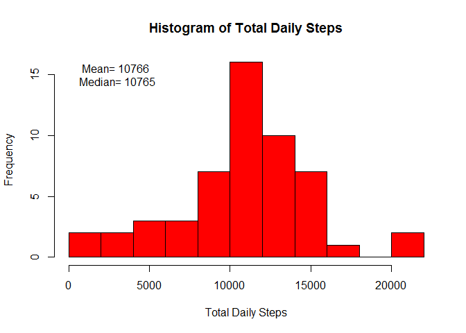
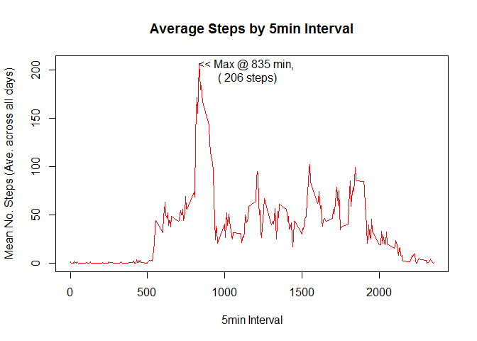
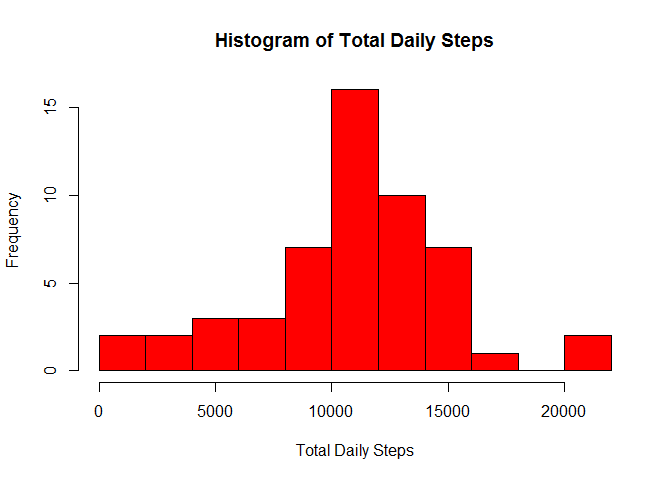
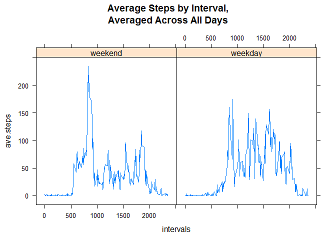

# Reproducible Research: Peer Assessment 1


## Loading and preprocessing the data

```r
if(!file.exists("activity.csv")) {
unzip("activity.zip")}
activity <- read.csv("activity.csv")
```


## What is mean total number of steps taken per day?

```r
dates <- levels(activity$date)
TotalsByDate <- vector("numeric")
for(i in dates) {
TotalsByDate <- c(TotalsByDate,sum(activity[activity$date==i,1]))
}
hist(TotalsByDate, main="Histogram of Total Daily Steps", xlab="Total Daily Steps", breaks=8, col="red")
text(3000, 15, labels=c(paste("Mean=",as.integer(mean(TotalsByDate, na.rm=T)), paste("\nMedian=", as.integer(median(TotalsByDate, na.rm=T))))))
```

<!-- -->

```r
rm(i)
```

## What is the average daily activity pattern?

```r
intervals <- unique(activity$interval)
AvesByIntv <- vector("integer")
for(i in intervals) {
AvesByIntv <- c(AvesByIntv, mean(activity[activity$interval==i,1], na.rm=T))
}
plot(intervals, AvesByIntv, type="l", col="red", lwd="1",
main="Average Steps by 5min Interval",
xlab="5min Interval",
ylab="Mean No. Steps (Ave. across all days)")
text(1140, 200, paste("<< Max @", intervals[which(AvesByIntv==max(AvesByIntv))], "min,\n","(", as.integer(max(AvesByIntv)), "steps)"))
```

<!-- -->

```r
rm(i)
activityCP <- activity
print(paste("There are",sum(complete.cases(activity)),"complete observations in the dataset."))
```

```
## [1] "There are 15264 complete observations in the dataset."
```

```r
print(paste("There are",sum(!complete.cases(activity)),"rows containing NAs."))
```

```
## [1] "There are 2304 rows containing NAs."
```

## Imputing missing values

```r
#replace NAs in activity$steps with respective interval means
activityCP <- activity
NAindx <- which(is.na(activity$steps))
IntAves4NArows <- data.frame(intv=unique(activity$interval), mean=AvesByIntv)
df <- data.frame(index=NAindx, intv=activity[is.na(activity$steps),"interval"])
for(i in df$index) {
activityCP[i,1] <- IntAves4NArows[IntAves4NArows$intv==activity[i,"interval"],2]
}
rplTotalsByDate <- vector("numeric")
for(i in dates) {
rplTotalsByDate <- c(rplTotalsByDate,sum(activity[activity$date==i,1]))
}
hist(TotalsByDate, main="Histogram of Total Daily Steps", xlab="Total Daily Steps", breaks=8, col="red")
text(3000, 30, labels=c(paste("Mean=",as.integer(mean(rplTotalsByDate, na.rm=T)), paste("\nMedian=", as.integer(median(rplTotalsByDate, na.rm=T))))))
```

<!-- -->

```r
rm(i)
rm(activityCP)
print(paste("There are",sum(complete.cases(activity)),"complete observations in the dataset."))
```

```
## [1] "There are 15264 complete observations in the dataset."
```

```r
print(paste("There are",sum(!complete.cases(activity)),"rows containing NAs."))
```

```
## [1] "There are 2304 rows containing NAs."
```


## Are there differences in activity patterns between weekdays and weekends?

```r
if(!require(lattice)) {install.packages("lattice")}
```

```
## Loading required package: lattice
```

```r
library(lattice)
actV <- activity
actV <- transform(actV, wDays=weekdays(as.Date(actV$date)), Type=vector("character", length=length(actV$date)))
actV$Type <- ifelse(actV$wDays %in% c("Saturday", "Sunday"), "weekend", "weekday")
wd <- actV[actV$Type=="weekday",]
we <- actV[actV$Type=="weekend",]
IntvAvesWE <- vector("integer")
IntvAvesWD <- vector("integer")
for(i in intervals) {
IntvAvesWE <- c(IntvAvesWE, mean(we[we$interval==i,1], na.rm=T))
}
for(i in intervals) {
IntvAvesWD <- c(IntvAvesWD, mean(wd[wd$interval==i,1], na.rm=T))
}
satsun <- rep("weekend", 288)
mtwrf <- rep("weekday", 288)
IntAvesD <- data.frame(intervals, ave.steps=IntvAvesWD, day=satsun)
IntAvesE <- data.frame(intervals, ave.steps=IntvAvesWE, day=mtwrf)
tmp <- as.data.frame(rbind(IntAvesD,IntAvesE))
xyplot(ave.steps~intervals|day, data=tmp, type="l", main="Average Steps by Interval,\nAveraged Across All Days")
```

<!-- -->
